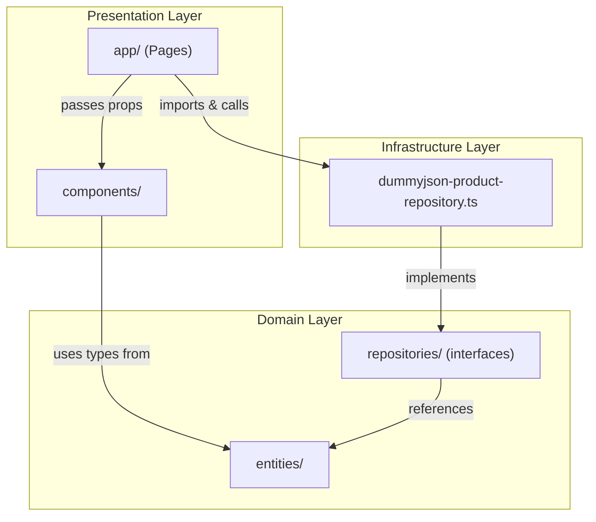
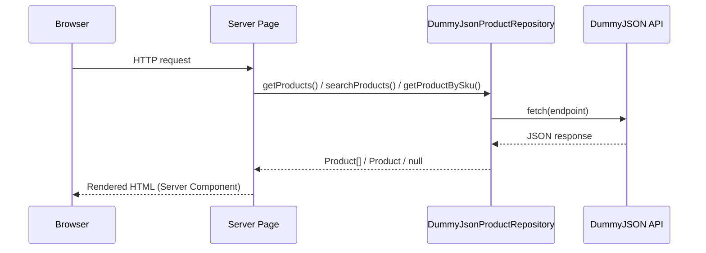
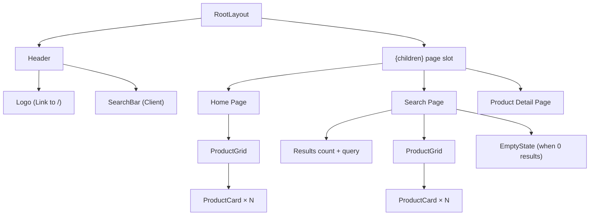

# Design Document — Bidcom E-Commerce

## Overview

This application is a server-rendered e-commerce frontend built with Next.js 16 (App Router), React 19, and TypeScript in strict mode. It replicates the Bidcom site visually while consuming data from the DummyJSON public API. The architecture follows Clean Architecture principles with strict dependency rules: domain defines contracts, infrastructure implements them, and the presentation layer (pages + components) orchestrates data flow through props.

### Key Design Decisions

1. **Server Components by default** — All pages and data-display components render on the server. Only `SearchBar` uses `"use client"` since it handles user input and programmatic navigation.
2. **SKU lookup via full fetch** — DummyJSON has no endpoint to query by SKU directly. The strategy is to fetch all products (`limit=0`) and filter in-memory on the server. This is acceptable given the dataset size (~194 products).
3. **No client-side state management** — Data flows top-down from server pages through props. No context providers or global stores needed.
4. **Repository pattern** — A single `IProductRepository` interface in the domain layer abstracts all data access. The infrastructure provides `DummyJsonProductRepository` implementing it via `fetch`.

## Architecture

### Layer Diagram



### Dependency Rules

| Source | Can depend on | Cannot depend on |
|--------|--------------|------------------|
| `domain/` | Nothing | `infrastructure/`, `components/`, `app/` |
| `infrastructure/` | `domain/` | `components/`, `app/` |
| `components/` | `domain/` (types only), `lib/` | `infrastructure/`, `app/` |
| `app/` | `components/`, `infrastructure/`, `domain/` | — |

### Data Flow



### Server vs Client Component Boundaries

| Component | Type | Reason |
|-----------|------|--------|
| `app/page.tsx` | Server | Fetches products, no interactivity |
| `app/search/page.tsx` | Server | Fetches search results |
| `app/product/[sku]/page.tsx` | Server | Fetches single product |
| `layout.tsx` | Server | Static shell |
| `Header` | Server | Only renders logo + embeds SearchBar |
| `SearchBar` | **Client** | `useState` for input, `useRouter` for navigation |
| `ProductCard` | Server | Pure display |
| `ProductGrid` | Server | Pure display |
| `EmptyState` | Server | Pure display with links |

## Components and Interfaces

### Component Hierarchy



### Component Interfaces

```typescript
// ProductCard
interface ProductCardProps {
  readonly title: string;
  readonly price: number;
  readonly thumbnail: string;
  readonly sku: string;
}

// ProductGrid
interface ProductGridProps {
  readonly products: ReadonlyArray<Product>;
}

// SearchBar — Client Component
// Internal state: query string
// On submit: router.push(`/search?s=${query}`)

// Header
// No props — contains Logo link and SearchBar

// EmptyState
interface EmptyStateProps {
  readonly categories: ReadonlyArray<Category>;
}
```

### Repository Interface

```typescript
// src/domain/repositories/product-repository.ts
interface IProductRepository {
  getProducts(limit: number): Promise<Product[]>;
  searchProducts(query: string, limit: number): Promise<SearchResult>;
  getProductBySku(sku: string): Promise<Product | null>;
  getCategories(): Promise<Category[]>;
}
```

### Infrastructure Implementation

```typescript
// src/infrastructure/repositories/dummyjson-product-repository.ts
class DummyJsonProductRepository implements IProductRepository {
  private readonly baseUrl = 'https://dummyjson.com';

  async getProducts(limit: number): Promise<Product[]> {
    // GET /products?limit={limit}
    // Maps raw response to Product[]
  }

  async searchProducts(query: string, limit: number): Promise<SearchResult> {
    // GET /products/search?q={query}&limit={limit}
    // Maps raw response to SearchResult
  }

  async getProductBySku(sku: string): Promise<Product | null> {
    // GET /products?limit=0
    // Finds product where product.sku === sku
    // Returns null if not found
  }

  async getCategories(): Promise<Category[]> {
    // GET /products/categories
    // Maps raw response to Category[]
  }
}
```

### Page Orchestration

Each page acts as the composition root:

```typescript
// app/page.tsx (Home)
export default async function HomePage() {
  const repo = new DummyJsonProductRepository();
  const products = await repo.getProducts(20);
  return <ProductGrid products={products} />;
}

// app/search/page.tsx
export default async function SearchPage({ searchParams }) {
  const repo = new DummyJsonProductRepository();
  const query = searchParams.s;
  const result = await repo.searchProducts(query, 20);
  if (result.products.length === 0) {
    const categories = await repo.getCategories();
    return <EmptyState categories={categories.slice(0, 5)} />;
  }
  return (
    <>
      <ResultsHeader total={result.total} query={query} />
      <ProductGrid products={result.products} />
    </>
  );
}

// app/product/[sku]/page.tsx
export default async function ProductDetailPage({ params }) {
  const repo = new DummyJsonProductRepository();
  const product = await repo.getProductBySku(params.sku);
  if (!product) notFound();
  return <ProductDetail product={product} />;
}
```

### SEO — Dynamic Metadata

```typescript
// app/search/page.tsx
export async function generateMetadata({ searchParams }): Promise<Metadata> {
  return { title: `Resultados para ${searchParams.s}` };
}

// app/product/[sku]/page.tsx
export async function generateMetadata({ params }): Promise<Metadata> {
  const repo = new DummyJsonProductRepository();
  const product = await repo.getProductBySku(params.sku);
  if (!product) return { title: 'Producto no encontrado' };
  return { title: product.title, description: product.description };
}
```

## Data Models

### Domain Entities

```typescript
// src/domain/entities/product.ts

interface Product {
  readonly id: number;
  readonly sku: string;
  readonly title: string;
  readonly description: string;
  readonly category: string;
  readonly price: number;
  readonly thumbnail: string;
}

interface Category {
  readonly slug: string;
  readonly name: string;
  readonly url: string;
}

interface SearchResult {
  readonly products: ReadonlyArray<Product>;
  readonly total: number;
  readonly skip: number;
  readonly limit: number;
}
```

### DummyJSON API Response Shapes

The infrastructure layer maps these raw responses to domain entities:

```typescript
// Raw API response for GET /products and GET /products/search
interface DummyJsonProductsResponse {
  products: DummyJsonProduct[];
  total: number;
  skip: number;
  limit: number;
}

interface DummyJsonProduct {
  id: number;
  title: string;
  description: string;
  category: string;
  price: number;
  discountPercentage: number;
  rating: number;
  stock: number;
  tags: string[];
  brand: string;
  sku: string;
  weight: number;
  dimensions: { width: number; height: number; depth: number };
  warrantyInformation: string;
  shippingInformation: string;
  availabilityStatus: string;
  reviews: unknown[];
  returnPolicy: string;
  minimumOrderQuantity: number;
  meta: { createdAt: string; updatedAt: string; barcode: string; qrCode: string };
  thumbnail: string;
  images: string[];
}

// Raw API response for GET /products/categories
interface DummyJsonCategory {
  slug: string;
  name: string;
  url: string;
}
```

### Mapping Function

```typescript
function mapToProduct(raw: DummyJsonProduct): Product {
  return {
    id: raw.id,
    sku: raw.sku,
    title: raw.title,
    description: raw.description,
    category: raw.category,
    price: raw.price,
    thumbnail: raw.thumbnail,
  };
}
```


## Correctness Properties

*A property is a characteristic or behavior that should hold true across all valid executions of a system — essentially, a formal statement about what the system should do. Properties serve as the bridge between human-readable specifications and machine-verifiable correctness guarantees.*

### Property 1: ProductGrid never renders more than 20 items

*For any* array of products of arbitrary length (0 to N), the ProductGrid component SHALL render at most 20 ProductCard elements.

**Validates: Requirements 1.2, 2.7**

### Property 2: ProductCard link contains correct SKU

*For any* product with any valid SKU string, the ProductCard component SHALL render a link whose `href` equals `/product/{sku}`.

**Validates: Requirements 1.3**

### Property 3: SearchBar navigates to correct search URL

*For any* non-empty query string entered in the SearchBar, submitting the search (via Enter key or button click) SHALL trigger navigation to `/search?s={query}`.

**Validates: Requirements 2.2, 2.3**

### Property 4: Search page displays query and total count

*For any* search query string and any SearchResult with a numeric `total`, the Search_Page SHALL render both the query string and the total count in its output.

**Validates: Requirements 2.5, 2.6**

### Property 5: EmptyState renders exactly 5 category links

*For any* array of categories with length ≥ 5, the EmptyState component SHALL render exactly 5 clickable links corresponding to the first 5 categories.

**Validates: Requirements 3.3**

### Property 6: Category links navigate to correct search URL

*For any* category with any `name` value, the EmptyState category link SHALL have an `href` equal to `/search?s={category_name}`.

**Validates: Requirements 3.4**

### Property 7: Repository SKU lookup returns correct result

*For any* array of products and any SKU string, `getProductBySku(sku)` SHALL return the product whose `sku` field matches the given string if one exists, or `null` if no product matches.

**Validates: Requirements 4.2, 4.4**

### Property 8: Product mapping round trip preserves domain fields

*For any* valid DummyJSON product response object, mapping it to a domain `Product` and then verifying each field SHALL preserve `id`, `sku`, `title`, `description`, `category`, `price`, and `thumbnail` without loss or mutation.

**Validates: Requirements 9.3**

### Property 9: ProductCard renders all required fields

*For any* product with any title string, numeric price, and thumbnail URL, the ProductCard component SHALL render all three values (thumbnail as image src, title as text, price as formatted text).

**Validates: Requirements 7.5**

### Property 10: Product detail page renders all product information

*For any* product with any values for image, title, price, category, and description, the Product_Detail_Page SHALL render all five pieces of information.

**Validates: Requirements 4.3**

### Property 11: Metadata generation produces correct SEO values

*For any* search query string, `generateMetadata` for the Search_Page SHALL return a title containing that query string. *For any* product, `generateMetadata` for the Product_Detail_Page SHALL return a title equal to the product title and a description equal to the product description.

**Validates: Requirements 6.1, 6.2, 6.3**

## Error Handling

### Strategy

| Scenario | Handling | User-facing message |
|----------|----------|---------------------|
| API fetch failure (home/search) | Repository throws, page catches via `error.tsx` | "Ocurrió un error al cargar los productos." |
| Product not found by SKU | Repository returns `null`, page calls `notFound()` | Next.js 404 page |
| Empty search results | Not an error — render `EmptyState` | "No se encontró ningún producto. Te recomendamos buscar estas categorías." |
| Network timeout | Same as API fetch failure | Same error message |

### Error Boundaries

```
app/
├── error.tsx          → Catches unhandled errors in all pages
├── not-found.tsx      → Custom 404 page
├── search/
│   └── error.tsx      → Catches search-specific errors (optional override)
└── product/
    └── [sku]/
        └── not-found.tsx  → Product-specific 404
```

### Repository Error Pattern

```typescript
class DummyJsonProductRepository implements IProductRepository {
  private async fetchJson<T>(url: string): Promise<T> {
    const response = await fetch(url);
    if (!response.ok) {
      throw new Error(`API error: ${response.status} ${response.statusText}`);
    }
    return response.json() as Promise<T>;
  }
}
```

Pages do not try/catch — they let errors propagate to the nearest `error.tsx` boundary where the user sees the localized error message.

## Testing Strategy

### Framework & Tools

- **Test runner**: Vitest (fast, ESM-native, compatible with Next.js)
- **Component testing**: React Testing Library (`@testing-library/react`)
- **Property-based testing**: `fast-check` (most popular PBT library for TypeScript/JavaScript)
- **Mocking**: Vitest built-in `vi.mock` / `vi.fn` for fetch and router

### Test File Organization

```
src/tests/
├── components/
│   ├── ProductCard.test.tsx
│   ├── ProductGrid.test.tsx
│   ├── SearchBar.test.tsx
│   ├── Header.test.tsx
│   └── EmptyState.test.tsx
├── infrastructure/
│   └── dummyjson-product-repository.test.ts
└── properties/
    ├── product-grid.property.test.tsx
    ├── product-card.property.test.tsx
    ├── search-bar.property.test.tsx
    ├── repository.property.test.ts
    └── metadata.property.test.ts
```

### Dual Testing Approach

**Unit tests** (example-based):
- Verify specific rendering scenarios (Header has logo, SearchBar has input + button)
- Test error states (API failure shows error message, missing SKU shows 404)
- Test edge cases (empty search results trigger EmptyState)
- Test responsive layout classes at specific breakpoints

**Property tests** (fast-check, minimum 100 iterations each):
- Each property test maps to a Correctness Property above
- Tag format: `// Feature: bidcom-ecommerce, Property N: {property_text}`
- Generators produce random products, categories, query strings, and SKUs
- Verify universal invariants hold across all generated inputs

### Property Test Configuration

```typescript
import fc from 'fast-check';

// Minimum 100 iterations per property
const PROPERTY_CONFIG = { numRuns: 100 };

// Generators
const productArb = fc.record({
  id: fc.nat(),
  sku: fc.string({ minLength: 1, maxLength: 20 }),
  title: fc.string({ minLength: 1 }),
  description: fc.string(),
  category: fc.string({ minLength: 1 }),
  price: fc.float({ min: 0.01, max: 99999, noNaN: true }),
  thumbnail: fc.webUrl(),
});

const categoryArb = fc.record({
  slug: fc.string({ minLength: 1 }),
  name: fc.string({ minLength: 1 }),
  url: fc.webUrl(),
});

const queryArb = fc.string({ minLength: 1, maxLength: 100 });
```

### Storybook Configuration

- Storybook 8 with `@storybook/nextjs` framework
- Stories located in `src/stories/`
- One story file per component: `ProductCard.stories.tsx`, `SearchBar.stories.tsx`, `Header.stories.tsx`, `EmptyState.stories.tsx`, `ProductGrid.stories.tsx`
- Use CSF3 format (Component Story Format 3)
- Include variants: default state, loading state, error state, mobile/desktop viewports

### Test Commands

```json
{
  "test": "vitest --run",
  "test:watch": "vitest",
  "test:coverage": "vitest --run --coverage",
  "storybook": "storybook dev -p 6006",
  "build-storybook": "storybook build"
}
```
